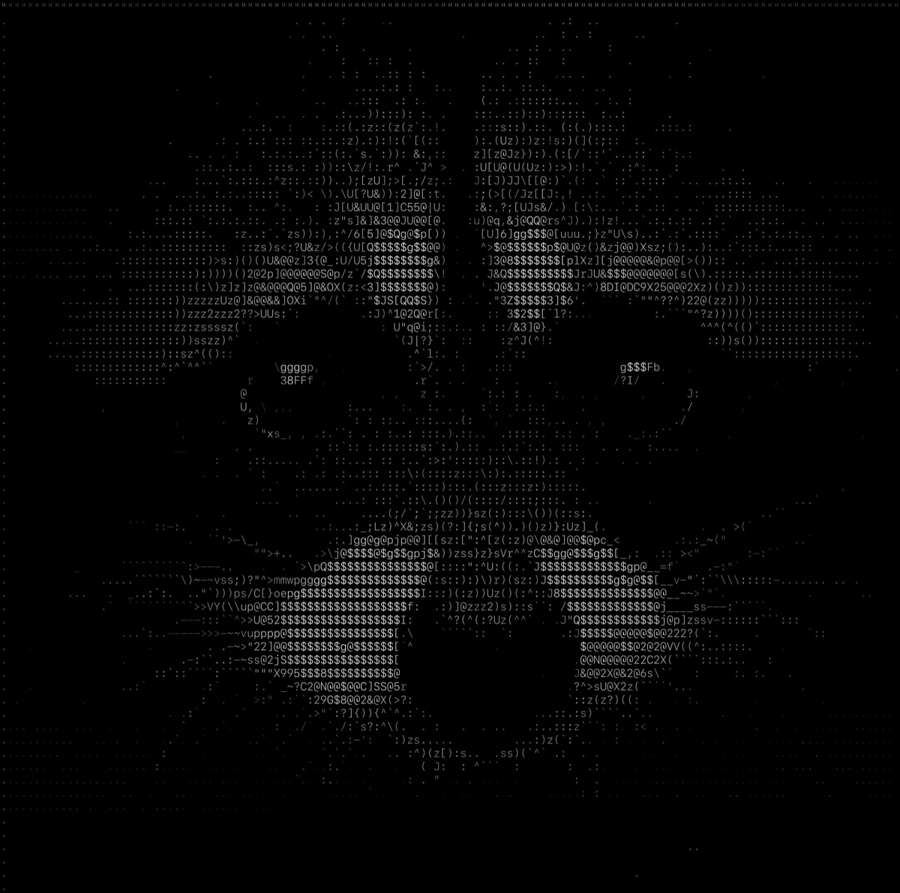

# Glif

[](https://github.com/artalis-io/glif/actions/workflows/ci.yaml)

Shape-based ASCII art renderer in C. Converts images and video into ASCII art using **6D shape vectors** instead of scalar brightness, producing sharp contour-aware output with readable edges.

Supports images, live terminal video, video transcoding, webcam, and runs in the browser via WebAssembly.



**[Live demo](https://glif.artalis.io)**

## How it works

Traditional ASCII art maps each cell to a character by brightness alone. Glif instead samples **6 overlapping circles** arranged in a 3x2 staggered grid within each cell, producing a 6-dimensional shape vector. Characters are matched by nearest-neighbor distance in 6D Euclidean space, so a diagonal stroke matches `/` rather than a medium-brightness character like `+`.

The pipeline:

1. **Lightness map** — Convert sRGB pixels to linear luminance via a 256-entry LUT
2. **Grid decomposition** — Divide the image into cells (default 10x20px, 2:1 aspect)
3. **Shape vectors** — Sample 6 internal circles per cell into a Vec6
4. **External sampling** — Sample 10 circles outside each cell boundary into a Vec10
5. **Directional contrast** — Diff internal vs. neighboring external samples, normalize, exponentiate
6. **Global contrast** — Normalize by max component, exponentiate
7. **Character matching** — Find nearest character Vec6 in the precomputed font database
8. **Adaptive contrast** — Per-frame percentile analysis adjusts contrast for dark/bright scenes
9. **Temporal stabilization** — EMA smoothing of normalization, shape vectors, contrast stats, and character hysteresis to reduce flicker in video

## Building

```bash
make          # build glif CLI
make wasm     # build WebAssembly (requires Emscripten)
make test     # run unit tests (136 tests)
make debug    # build with AddressSanitizer + UBSan
```

Requires a C11 compiler and OpenMP. On macOS:

```bash
brew install libomp
```

No other dependencies — `stb_image.h`, `stb_truetype.h`, Nuklear, and Clay are vendored.

## Usage

```bash
# Plain ASCII
./glif photo.png -f fonts/GeistMono-Regular.ttf

# ANSI truecolor terminal output
./glif photo.png -f fonts/GeistMono-Regular.ttf -c

# Auto-fit to terminal, colored
./glif photo.png -f fonts/GeistMono-Regular.ttf -a -c

# PPM image output (scale 4 for crisp glyphs)
./glif photo.png -f fonts/GeistMono-Regular.ttf -o output.ppm -s 4

# Dark mode PPM (black background, colored glyphs)
./glif photo.png -f fonts/GeistMono-Regular.ttf -o output.ppm --dark

# High contrast for line art
./glif diagram.png -f fonts/GeistMono-Regular.ttf -d 3.0 -g 3.0
```

A monospace TTF font is required via `-f`. The font's glyph shapes directly affect output quality — different fonts produce different results.

## Options

| Flag | Description | Default |
|------|-------------|---------|
| `-f, --font <path>` | Monospace TTF font (required) | — |
| `-w, --cell-width <px>` | Cell width in pixels | 10 |
| `-h, --cell-height <px>` | Cell height in pixels | 20 |
| `-d, --dir-crunch <f>` | Directional contrast exponent | 1.25 |
| `-g, --global-crunch <f>` | Global contrast exponent | 1.5 |
| `-a, --auto-fit` | Fit output to terminal size | off |
| `-c, --color` | ANSI truecolor terminal output | off |
| `-o, --output <file>` | Write PPM image file | — |
| `-s, --scale <n>` | PPM render scale | 4 |
| `--dark` | Black background + colored glyphs | off |
| `--video <W> <H>` | Video mode: read raw RGB24 frames from stdin | — |
| `--fps <n>` | Target framerate | 30 |
| `--pipe-ppm` | Video: write PPM frames to stdout | off |
| `--pipe-raw` | Video: write raw RGB24 to stdout | off |
| `--v4l2 <device>` | Video: write to v4l2loopback (Linux) | — |
| `--adapt-floor <0-255>` | Adaptive contrast noise floor | off |
| `--adapt-ceil <0-255>` | Adaptive contrast ceiling | 80 |
| `--output-glif <path>` | Video: write .glif binary file | — |

## Video in terminal

Pipe raw RGB24 frames from ffmpeg to render video as live ASCII art:

```bash
# Color ASCII video, auto-fit to terminal
ffmpeg -i video.mp4 -f rawvideo -pix_fmt rgb24 -s 640x480 - 2>/dev/null | \
  ./glif --video 640 480 -f fonts/GeistMono-Regular.ttf -c -a --fps 30

# Higher resolution input
ffmpeg -i video.mp4 -f rawvideo -pix_fmt rgb24 -s 640x480 - 2>/dev/null | \
  ./glif --video 640 480 -f fonts/GeistMono-Regular.ttf -c -a --fps 30 --dark

# Adaptive contrast (better for varying lighting)
ffmpeg -i video.mp4 -f rawvideo -pix_fmt rgb24 -s 640x480 - 2>/dev/null | \
  ./glif --video 640 480 -f fonts/GeistMono-Regular.ttf -c -a --fps 30 \
    --adapt-floor 5 --adapt-ceil 80
```

Uses diff-based rendering — only changed cells are emitted as ANSI escape codes. A byte-cost estimator dynamically chooses between diff and full redraw per frame.

## Video transcoding

Transcode any video into an ASCII art MP4 with audio using the convenience script:

```bash
# High-res (default) — 4x8 cells, scale 4, high contrast
./scripts/glif-transcode.sh movie.mp4

# Dark scenes — lower contrast, preserves shadow detail
./scripts/glif-transcode.sh movie.mp4 --dark

# Low-res retro — 120x40 grid, small file size
./scripts/glif-transcode.sh movie.mp4 --lo

# Custom output path
./scripts/glif-transcode.sh movie.mp4 -o output.mp4
```

The script probes the input for resolution and framerate, runs the full `ffmpeg -> glif -> ffmpeg` pipeline, and muxes the original audio track. ASCII art compresses well with x264 — large flat regions and repeated glyphs give favorable compression ratios.

| Preset | Cells | Scale | Contrast | Use case |
|--------|-------|-------|----------|----------|
| `--hi` (default) | 4x8 | 4 | 2.5 / 2.5 | Dense, crisp, high contrast |
| `--dark` | 4x8 | 4 | 1.3 / 1.3 | Dark scenes, night footage |
| `--lo` | 10x20 | 1 | 2.5 / 2.5 | Small file, retro look |

Or build the pipeline manually:

```bash
ffmpeg -i input.mp4 -f rawvideo -pix_fmt rgb24 -s 640x480 - 2>/dev/null | \
  ./glif --video 640 480 -f fonts/GeistPixel-Square.ttf --pipe-raw --dark -s 4 | \
  ffmpeg -f rawvideo -pix_fmt rgb24 -video_size 2560x1920 -framerate 30 -i - \
    -c:v libx264 -pix_fmt yuv420p output.mp4
```

## Virtual webcam

Turn your webcam into a live ASCII art camera visible in Zoom, Google Meet, etc.

**Linux (v4l2loopback):**

```bash
# One-liner with convenience script
./scripts/glif-webcam.sh

# Options
./scripts/glif-webcam.sh --src /dev/video0 --dst /dev/video10 --scale 2 --dark
./scripts/glif-webcam.sh --light --font fonts/GeistMono-Regular.ttf
```

The script auto-loads `v4l2loopback` if needed and uses direct v4l2 output (2 processes) when available, falling back to a 3-process pipe.

**macOS / Windows:** Use `--pipe-raw` piped through ffmpeg to OBS Virtual Camera. See [docs/webcam.md](docs/webcam.md) for setup on all platforms.

## Chrome extension

Real-time ASCII art overlay for any web video. Works on YouTube, Vimeo, Twitch, and any page with `<video>` elements.

<a href="https://chromewebstore.google.com/detail/EXTENSION_ID">
  
</a>
<a href="https://github.com/artalis-io/glif/releases/latest">
  
</a>

**Install from Chrome Web Store:** Click the badge above and press "Add to Chrome".

**Install from GitHub Release:** Download the `.zip` from [Releases](https://github.com/artalis-io/glif/releases/latest), unzip, open `chrome://extensions`, enable Developer Mode, click "Load unpacked", select the unzipped `extension/` folder.

**Build from source:**

```bash
make wasm-ext                          # build WASM for the extension
# Load extension/  as an unpacked extension in chrome://extensions
```

Features:
- **Video overlay** — ASCII art rendered via WebGL, positioned over the original video
- **Webcam interception** — Overrides `getUserMedia` so Zoom/Teams/Meet transmit ASCII art to other participants
- **SPA navigation** — Detects `pushState`/`replaceState` URL changes (YouTube, etc.) and re-attaches overlays
- **Deferred video detection** — MutationObserver catches `<video>` elements added after page load
- **Persistence** — Enabled state auto-restores on new tabs and page refreshes
- **Real-time controls** — Edge/contrast sliders and hi-res toggle update immediately

## Web demo

The C core compiles to WebAssembly via Emscripten. The web UI uses Nuklear for widgets, Clay for layout, and a WebGL font-atlas shader for GPU-accelerated rendering.

```bash
make wasm
cd web && python3 -m http.server 8000
```

Supports drag-and-drop images, video/GIF playback, and live webcam. All processing runs client-side. HiDPI/Retina displays are fully supported with DPR-aware canvas sizing and font atlas rendering.

**[Try it live at glif.artalis.io](https://glif.artalis.io)**

## Architecture

```
src/
  image.c/h         sRGB-to-linear lightness via LUT
  sampling.c/h      Circle sampling geometry and precomputed offset masks
  grid.c/h          Image-to-grid decomposition, Vec6/Vec10 computation
  font.c/h          Font rasterization and character shape database
  contrast.c/h      Directional + global + adaptive contrast enhancement
  match.c/h         Nearest-neighbor character matching with LRU cache
  output.c/h        Plain, ANSI, PPM, raw pipe, .glif binary output
  temporal.c/h      Temporal smoothing (normalization, shape, contrast, hysteresis)
  vec6.h            Header-only 6D/10D vector math
  main.c            CLI entry point

  platform/wasm/
    ui.c             WASM app: init, frame loop, rendering pipeline
    ext.c            Chrome extension WASM entry point (no UI, frame-driven)
    ui_layout.c/h    Responsive layout (desktop/tablet/mobile breakpoints)
    nk_webgl.c/h     Nuklear WebGL rendering backend
    nk_impl.c        Nuklear implementation defines
    clay_impl.c      Clay implementation defines

  platform/linux/
    v4l2_output.c/h  Direct v4l2loopback output

extension/              Chrome extension (Manifest V3)
  manifest.json         Extension manifest
  background.js         Service worker — script injection
  content.js            Content script — popup/renderer relay
  webcam-proxy.js       Main-world script at document_start — getUserMedia proxy
  content-webcam-early.js  Content script at document_start for webcam
  renderer.js           Main-world script — video overlay lifecycle
  webcam.js             Main-world script — webcam WASM pipeline + handler
  popup.html/js/css     Extension popup UI
  wasm/                 WASM build output (glif-ext.js + .wasm)
  test/                 Puppeteer smoke tests

vendor/               Vendored single-header libraries (stb, Nuklear, Clay, utest.h)
tests/                Unit tests (136 tests across 9 test files)
scripts/              Convenience scripts for transcoding and webcam
tools/                Benchmark tool
```

### Rendering pipeline

```
Input image/frame
       |
  sRGB -> linear luminance (LUT)
       |
  Grid decomposition (cells)
       |
  6 internal circles -> Vec6 shape vector
  10 external circles -> Vec10 contrast vector
       |
  Directional contrast (internal vs. neighbors)
  Global contrast (normalize + exponentiate)
  Adaptive contrast (per-frame percentile scaling)
       |
  [Temporal smoothing for video]
       |
  Nearest-neighbor match in 6D space -> character
       |
  Output: ASCII | ANSI | PPM | raw | .glif | WebGL
```

## Performance

Three optimizations enable real-time throughput:

1. **sRGB LUT** — 256-entry lookup table replaces per-pixel `powf()` (21x speedup)
2. **Precomputed circle masks** — Offset tables built at startup eliminate per-pixel distance tests; interior cells skip bounds checking (4.4x speedup)
3. **OpenMP + SIMD** — All pipeline stages parallelized; inner loops use SIMD reduction (2x+ on multicore)

Benchmarks on Apple M3 Pro (11 cores), `-O2`:

| Image | Resolution | Cells | Per-frame | FPS |
|-------|-----------|-------|-----------|-----|
| raccoon.jpg | 679x679 | 2,211 | 0.69 ms | 1,440 |
| wildboar.jpg | 1100x731 | 3,960 | 0.91 ms | 1,096 |

```bash
make tools/bench
./tools/bench images/raccoon.jpg -f fonts/GeistMono-Regular.ttf
```

## Testing

```bash
make test         # 136 C unit tests across 9 modules
npm run test:ext  # Chrome extension smoke tests (requires npm install)
```

C tests cover all pipeline stages: vector math, sampling, image loading, grid computation, contrast enhancement, character matching, output formats, and temporal smoothing. Uses [Sheredom's utest.h](https://github.com/sheredom/utest.h) framework.

Extension tests use Puppeteer to launch Chrome with the extension loaded, navigate to a test page with a synthetic video, and verify the full overlay lifecycle: injection, overlay creation, WebGL context, params/hi-res updates, disable/re-enable, SPA navigation (`pushState`), and `replaceState` no-op.

## Attribution

Implements the ASCII rendering technique from [Alex Harri's](https://alexharri.com) article **["Rendering ASCII art from images"](https://alexharri.com/blog/ascii-rendering)**. The core insight — representing characters as multi-dimensional shape vectors sampled from overlapping circles — comes from that article.

### Vendored libraries

| Library | Author | License |
|---------|--------|---------|
| [stb_image](https://github.com/nothings/stb) | Sean Barrett | Public domain |
| [stb_image_write](https://github.com/nothings/stb) | Sean Barrett | Public domain |
| [stb_truetype](https://github.com/nothings/stb) | Sean Barrett | Public domain |
| [stb_rect_pack](https://github.com/nothings/stb) | Sean Barrett | Public domain |
| [Nuklear](https://github.com/Immediate-Mode-UI/Nuklear) | Micha Mettke | MIT / Public domain |
| [Clay](https://github.com/nicbarker/clay) | Nic Barker | zlib |
| [utest.h](https://github.com/sheredom/utest.h) | Sheredom | Unlicense |

### Fonts

A monospace TTF font is required (`-f` flag). Fonts are user-provided and not included in the repository. During development, [Geist Mono](https://vercel.com/font) (SIL Open Font License) and SF Mono (Apple proprietary, not redistributable) were used for testing.

### Images

- `raccoon.jpg` and `wildboar.jpg` — Creative Commons licensed test images
- Utility images (`checkerboard.png`, `gradient.png`, `shapes.png`, `stripes.png`) — generated, no attribution needed

## License

MIT License. Copyright (c) 2026 Mark Farkas.
